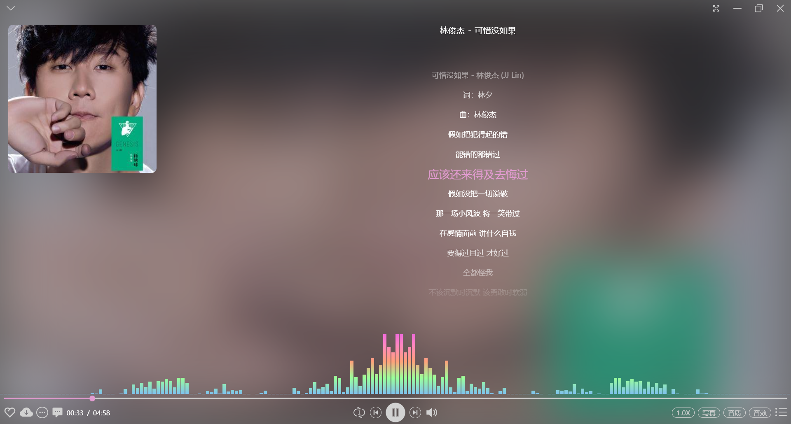
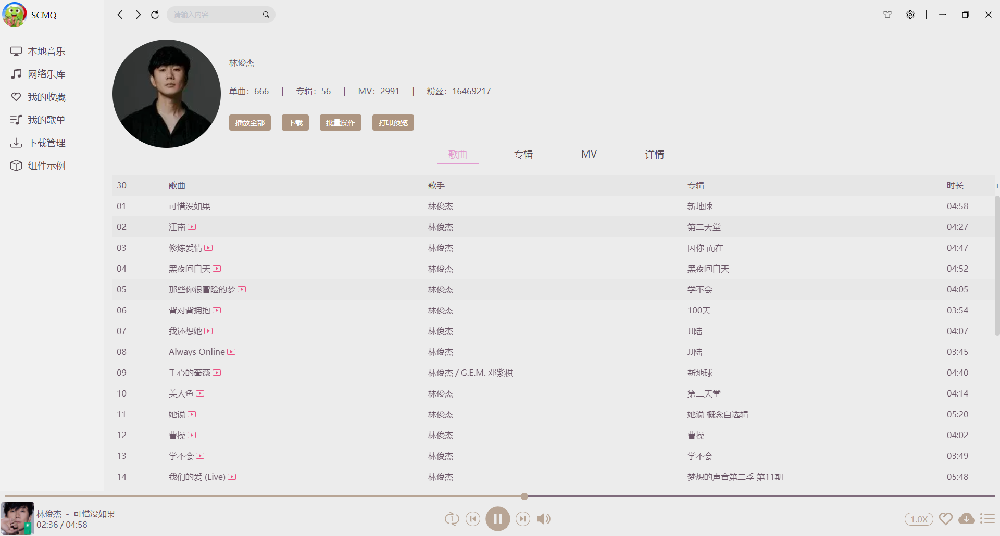
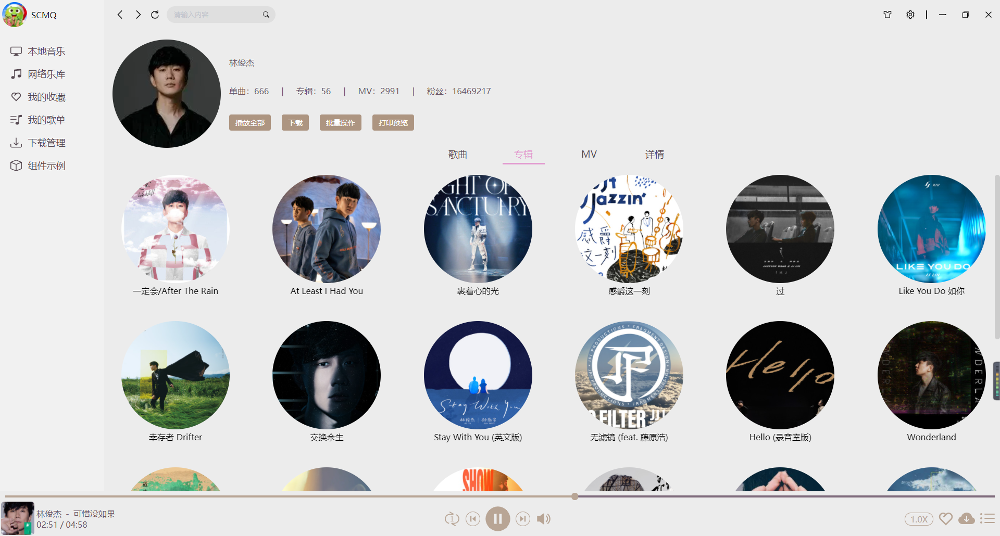
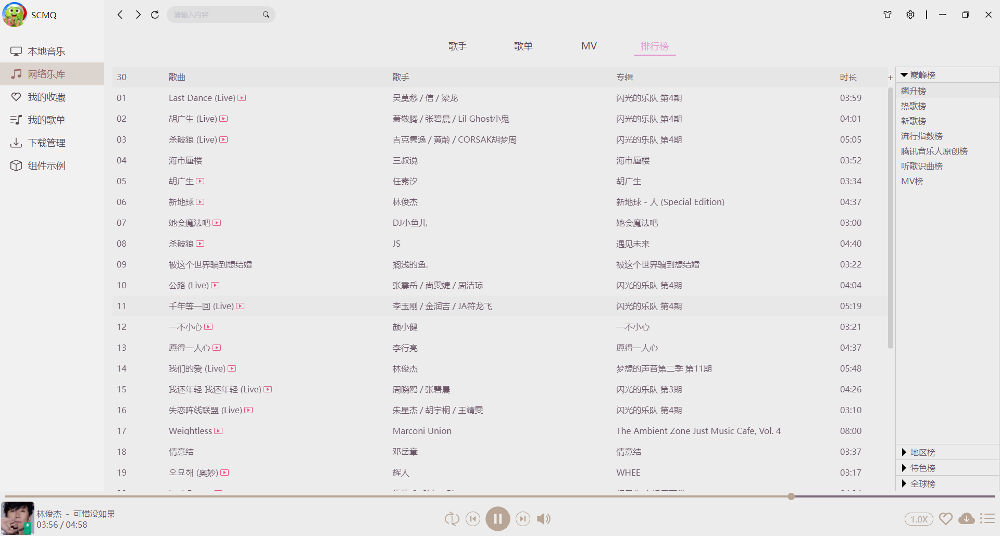
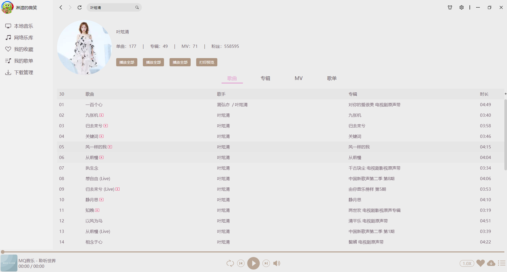

# mq-player-vue [](https://github.com/v-scmq/mq-player-vue) [](https://gitee.com/scmq/mq-player)

MQ音乐是一款基于Electron+Vue构建的桌面音乐播放器

### 项目技术栈


### 特性

1. 支持音乐频谱
2. 界面友好，支持皮肤切换
3. 跨平台，可打包Windows、Mac、Linux
4. 良好的架构模式和代码风格
5. 提供支持主流的第三方音乐平台

### 效果预览

+ 本地音乐


+ 播放详情



+ 歌手分类


+ 歌手歌曲



+ 歌手专辑



+ 歌单分类


+ MV分类


+ 榜单分类



+ 歌曲搜索



#### 问题汇集

> 1.electron不能加载本地资源(即使关闭webSecurity安全策略)

问题在于electron版本自身存在的问题,关闭Web安全策略仍然不能解决,反而出现了file协议不认识的情况,该问题解决方案在
[问题发现](https://github.com/electron/electron/issues/23664)
[问题解决](https://github.com/electron/electron/issues/23757) . 从解决的方案衍生一个不使用file协议,注册自定义文件协议,这样可以不关闭安全策略 且可以访问本地文件.

```javascript
import {protocol} from "electron";

app.whenReady().then(() => {
    // 注册文件协议必须在应用程序就绪后才能执行
    protocol.registerFileProtocol('fs', (request, callback) => {
        // request请求包含原始请求URL和header等信息
        const pathname = request.url.replace('fs://', '');

        // callback回调用于将文件(必须)绝对路径传入并做响应信息处理
        callback(pathname);
    });
});

```

> 2.Electron环境中的各种问题

1) 在渲染进程中,不能导入electron <br>
   使用window.require代替require,因为require会被webpack将其替换为__webpack_require__

2) 导入music-metadata库打包后在electron中报错 <br>
   若是直接在渲染进程中导入,需要在以下2个文件中将require('fs')替换为window.require('fs')
   %project_home%\node_modules\strtok3\lib\FsPromise.js (
   %project_home%\node_modules\music-metadata\lib\common\RandomFileReader.js <br>
   目前最佳方案:在preload.js中引入music-metadata,并且将preload.js在electron-builder插件配置选项中引入

3) 在Electron14以后警告不能在package.json中使用 【main:'background.js'】作为配置项, 若移除此配置项,在打包构建时,会找不到主进程相关文件(此时默认为index.js), 解决办法:
   在node-modules/vue-cli-plugin-electron-builder/index.js中的bundleMain方法中 修改mainConfig.entry(isBuild ? 'background' : '
   index') => mainConfig.entry('index')

### 位运算总结

```ecmascript 6

// 1.判断一个整数是偶数还是奇数 a & 1 == 0 ? 偶数 : 奇数
const isEvenNumber = value => value & 1 == 0;

// 2.取模(取余)运算,仅对 a % b (b = 2 ^ n)适用
const mod = (a, b) => a & --b;

// 3.两个整数交换 a = 1 , b = 2 => b = 1 , a = 2
const swap = (a, b) => {
    // a = a ^ b; b = a ^ b; a = a ^ b;
    a = (a ^ b) ^ (b = a);
};

// 4.判断一个数是否为2的n次方
// const isPowerOfTwo = value => (value & --value) == 0 && value != 0;
const isPowerOfTwo = value => value && (value & --value) == 0;

// 5.计算一个数的相反数
const opposite = value => ~value + 1;

// 6.计算2个数的平均数(有问题)
const average = (a, b) => (a & b) + ((a ^ b) >> 1);

// 7.计算一个数的绝对值(有问题)
const abs = a => {
    let b = a >> 31;
    return (a + b) ^ b; // ( a ^ b ) - b
}

```