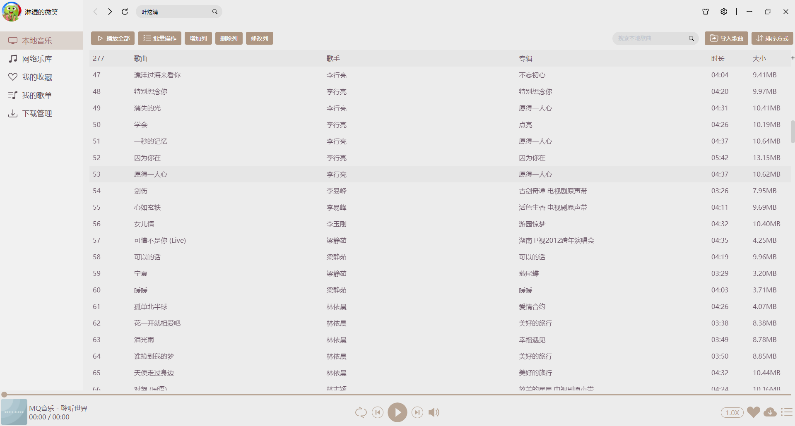
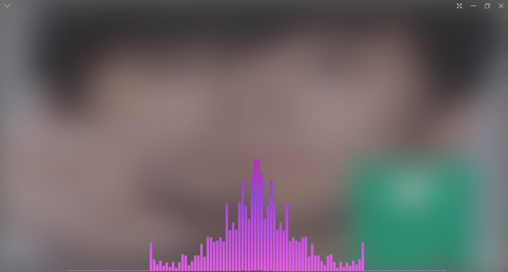
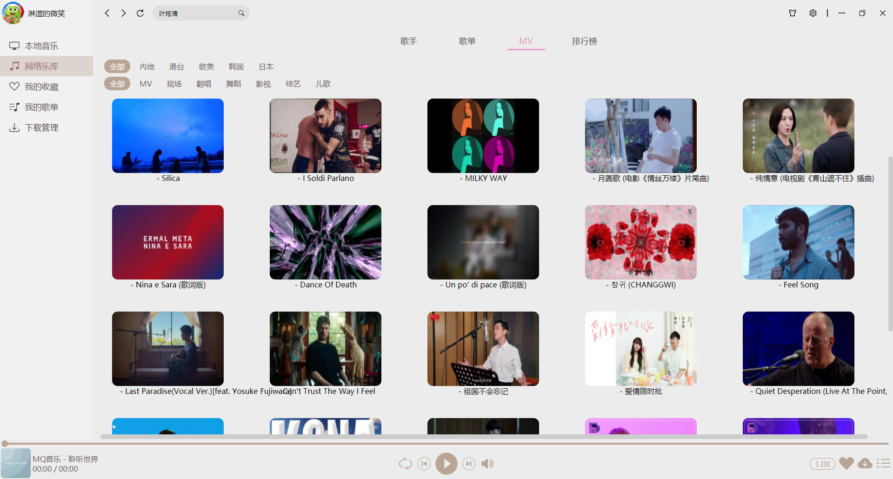
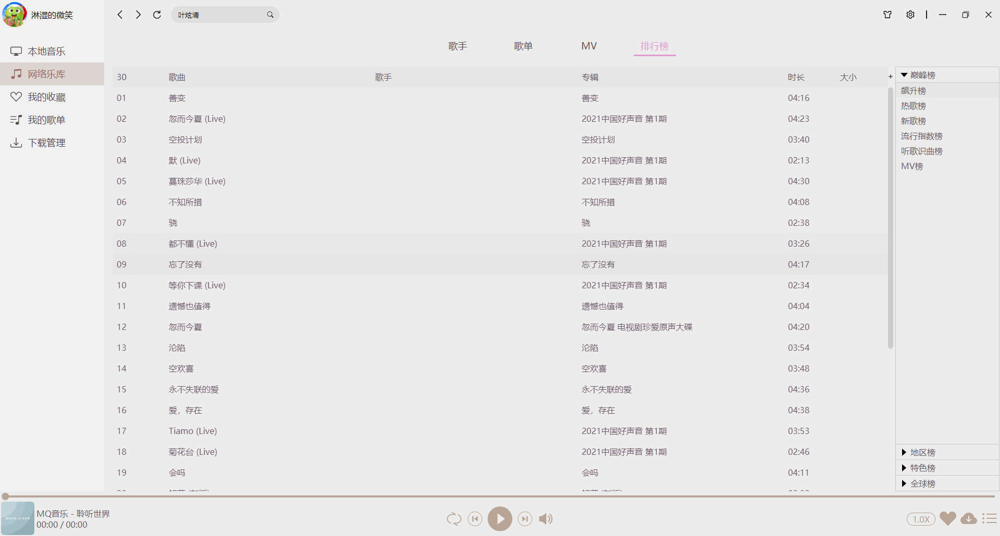
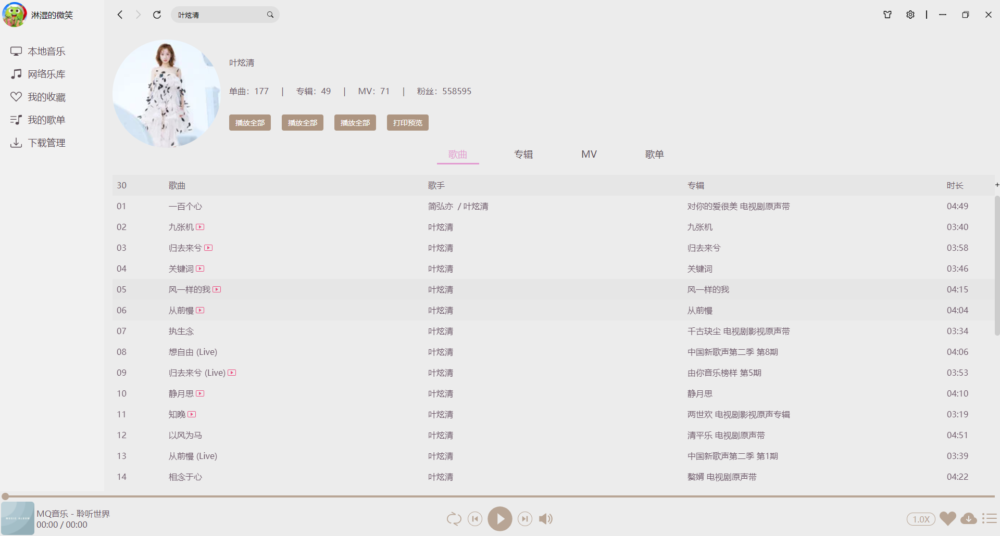

# mq-player-vue <a href="https://gitee.com/scmq/mq-player/"></a>

MQ音乐是一款基于Electron+Vue构建的桌面音乐播放器

### 项目技术栈

<div>
    
    
    
    
</div>

### 特性

1. 支持音乐频谱
2. 界面友好，支持皮肤切换
3. 跨平台，可打包Windows、Mac、Linux
4. 良好的架构模式和代码风格
5. 提供支持主流的第三方音乐平台

### 效果预览

+ 本地音乐



+ 播放详情



+ 歌手分类


+ MV分类



+ 榜单分类



+ 歌手详情


+ 歌曲搜索



#### 问题汇集

> 1.electron不能加载本地资源(即使关闭webSecurity安全策略)

问题在于electron版本自身的bug,关闭网页安全仍然不能解决,反而出现了file协议不认识的情况,该问题解决方案在
[问题发现](https://github.com/electron/electron/issues/23664)
[问题解决](https://github.com/electron/electron/issues/23757) . 从解决的方案衍生一个不使用file协议,注册自定义文件协议,这样可以不关闭安全策略 且可以访问本地文件.

```javascript
import {protocol} from "electron";

app.whenReady().then(() => {
    // 注册文件协议必须在应用程序就绪后才能执行
    protocol.registerFileProtocol('fs', (request, callback) => {
        // request请求包含原始请求URL和header等信息
        const pathname = request.url.replace('fs:///', '');

        // callback回调用于将文件(必须)绝对路径传入并做响应信息处理
        callback(pathname);
    });
});

```

> 2.Electron环境中的各种问题

  1) 在渲染进程中,不能导入electron <br>
        使用window.require代替require,因为require会被webpack将其替换为__webpack_require__

  2) 导入music-metadata库打包后在electron中报错 <br>
     若是直接在渲染进程中导入,需要在以下2个文件中将require('fs')替换为window.require('fs')
         %project_home%\node_modules\strtok3\lib\FsPromise.js (
         %project_home%\node_modules\music-metadata\lib\common\RandomFileReader.js <br>
     目前最佳方案:在preload.js中引入music-metadata,并且将preload.js在electron-builder插件配置选项中引入

> 3.文件上传总结

不论以下哪一种方式,form表单中的按钮默认有提交功能,若需要显示按钮,则应该用`<input type='button' value='按钮文本'/>`

1).前端部分

```html

<html lang>
<head>
    <title></title>
    <style>
        .v-row {
            display: flex;
            align-items: center;
        }

        .v-column {
            display: flex;
            flex-direction: column;
        }
    </style>
</head>
<body>
<div class="v-row">
    <form class="v-column" action="http://localhost:8080//api/upload" enctype="multipart/form-data" method="post">
        <div>通过普通表单上传文件</div>
        <div><input name="name"/></div>
        <div><input type="file" name="file1"/></div>
        <div><input type="file" name="file2"/></div>
        <div><input type="submit" value="上传"/></div>
        <div>
            <button>上传</button>
        </div>
    </form>

    <form class="v-column" id="form-upload">
        <div>通过ajax上传文件</div>
        <div><input name="name"/></div>
        <div><input type="file" id="file1" name="file1"/></div>
        <div><input type="file" id="file2" name="file2"/></div>
        <div><input type="button" id="submit-button" value="上传"/></div>
    </form>
</div>

<!-- 引入jquery -->
<!-- <script src="https://cdn.staticfile.org/jquery/1.10.2/jquery.min.js"></script> -->
<script>
    document.querySelector('#submit-button').onclick = () => {
        let formData = new FormData(document.querySelector('#form-upload'));
        let ajax = $ ? $['ajax'] : () => ({}); 
        ajax({
            type: 'POST',
            data: formData,
            url: "http://localhost:8080/api/upload",
            contentType: false, /* 发送信息至服务器时内容编码类型(String),这里明确指定为false */
            processData: false, /* 发送 DOM 树信息或其它不希望转换的信息,设置为 false */
        }).success(data => {
            console.info('success-data=>', data)
        }).error(data => {
            console.info('error-data=>', data)
        });
    };
</script>
</body>
</html>
```

2)后端部分

```java
import lombok.Data;
import org.springframework.web.multipart.MultipartFile;
@Data
public class UploadData {
    private String name;
    private MultipartFile file1;
    private MultipartFile file2;
}


import org.springframework.stereotype.Controller;
import org.springframework.web.bind.annotation.PostMapping;
import org.springframework.web.bind.annotation.RequestParam;
import org.springframework.web.bind.annotation.ResponseBody;
import org.springframework.web.multipart.MultipartFile;

@Controller
@RequestMapping("/api")
public class BaseController {
    @ResponseBody
    @PostMapping("/upload")
    public boolean upload(UploadData data) {
        if (data.getFile1() == null || data.getFile1().isEmpty()) {
            System.out.println("未选择文件！");
        }
        // ......
        return true;
    }
}

```

### 位运算总结

```ecmascript 6

// 1.判断一个整数是偶数还是奇数 a & 1 == 0 ? 偶数 : 奇数
const isEvenNumber = value => value & 1 == 0;

// 2.取模(取余)运算,仅对 a % b (b = 2 ^ n)适用
const mod = (a, b) => a & --b;

// 3.两个整数交换 a = 1 , b = 2 => b = 1 , a = 2
const swap = (a, b) => {
    // a = a ^ b; b = a ^ b; a = a ^ b;
    a = (a ^ b) ^ (b = a);
};

// 4.判断一个数是否为2的n次方
// const isPowerOfTwo = value => (value & --value) == 0 && value != 0;
const isPowerOfTwo = value => value && (value & --value) == 0;

// 5.计算一个数的相反数
const opposite = value => ~value + 1;

// 6.计算2个数的平均数(有问题)
const average = (a, b) => (a & b) + ((a ^ b) >> 1);

// 7.计算一个数的绝对值(有问题)
const abs = a => {
    let b = a >> 31;
    return (a + b) ^ b; // ( a ^ b ) - b
}

```